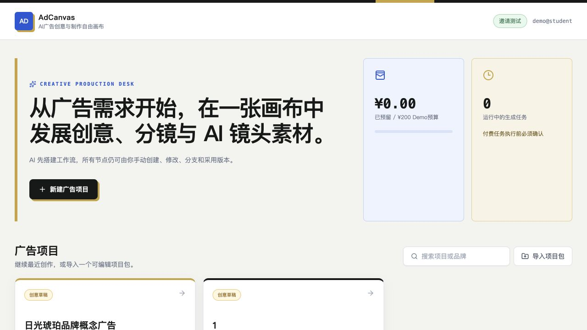

<div align="center">
  
  <h1>AdCanvas</h1>
  <p>面向广告创意与制作流程的 AI 自由画布</p>
  <p><strong>简体中文</strong> · <a href="./README_EN.md">English</a></p>
</div>



## 项目定位

AdCanvas 是一款面向广告创意团队的 PC Web Demo。它把广告 Brief、品牌规范、创意路线、情绪板、脚本、分镜、镜头素材、剪辑计划和交付包放进同一张可扩展画布，让 AI 负责生成与整理，人负责判断、修改和采用最终版本。

## 当前 Demo 已实现

- 广告项目工作台与本地项目持久化
- 9 类广告业务节点及手动创建、编辑和连接
- 从 Brief 生成三条创意路线的结构化工作流草案
- 项目级品牌规范、禁用内容、必备元素与节点局部覆盖
- 生成任务的费用确认、预算占用、幂等、取消和重试
- 节点版本保存、采用、分支与下游过期传播
- 可编辑项目包导入导出与生产交接清单
- 可解释的画布操作智能体与右侧创意对话智能体
- Gemini / OpenAI 等模型的 Provider Adapter 与无密钥安全降级
- FFmpeg 多镜头粗剪输出
- 黑白灰桌面工作台与画布界面

## 核心流程

```text
广告 Brief
  → 品牌约束
  → 创意路线
  → 情绪板 / 脚本
  → 分镜
  → 镜头生成
  → 剪辑计划
  → 交付包
```

所有关键业务能力都通过节点注册表、Provider Adapter 和任务执行器保留扩展接口，后续可以增加新的广告节点、模型供应商、审核规则与交付格式。

## 技术栈

- React 19 + TypeScript
- Vite 6
- Express
- Three.js / React Three Fiber
- Gemini、OpenAI、Kling、Hailuo、Fal.ai 适配层
- FFmpeg
- Node.js 原生测试

## 本地运行

要求 Node.js 20 或更高版本，并在系统中安装 FFmpeg。

```bash
git clone https://github.com/axbgs123/adcanvas.git
cd adcanvas
npm install
npm run dev
```

启动后访问：

- 前端：`http://localhost:5173`
- 后端：`http://localhost:3001`

没有配置模型密钥时，项目仍可体验工作台、业务节点、版本系统、任务确认和本地可解释智能体；真实生成任务会明确提示 Provider 不可用，不会伪造成功结果。

可选环境变量：

```env
GEMINI_API_KEY=
OPENAI_API_KEY=
KLING_ACCESS_KEY=
KLING_SECRET_KEY=
HAILUO_API_KEY=
FAL_API_KEY=
DEMO_ACCOUNT_BUDGET_CNY=200
FFMPEG_PATH=ffmpeg
```

## 验证

```bash
npm run typecheck
npm run test:server
npm run test:domain
npm run build
```

当前自动化测试共 30 项，覆盖 Provider 选择、任务状态机、预算与费用确认、项目包、品牌约束、画布操作规划、节点版本和 FFmpeg 粗剪。

## 文档

- [产品与开发计划](docs/plans/2026-08-25-ai-ad-platform-implementation-plan.md)
- [前端视觉方向](docs/design/2026-08-26-light-ui-direction.md)
- [视频剪辑节点](docs/video-editor-node.md)

## 来源与许可

AdCanvas 基于 [SankaiAI/TwitCanva-Video-Workflow](https://github.com/SankaiAI/TwitCanva-Video-Workflow) 的 Apache-2.0 代码进行二次开发。项目保留原始 [`LICENSE`](LICENSE)、[`NOTICE`](NOTICE) 和版权声明。

README 中只展示 AdCanvas 自己的页面和功能，不使用上游项目的演示视频作为本项目成果。
