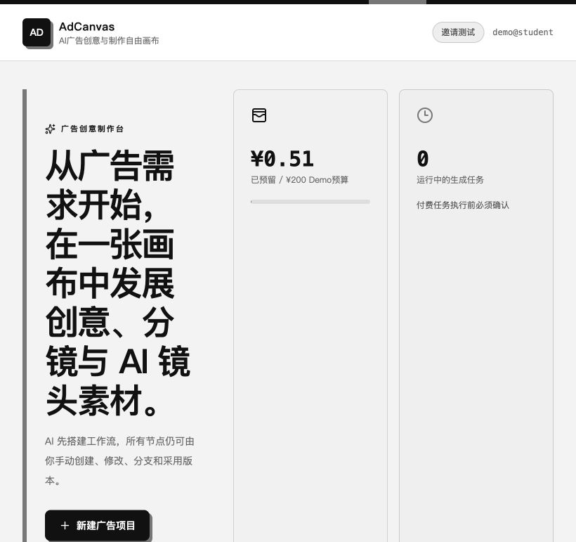
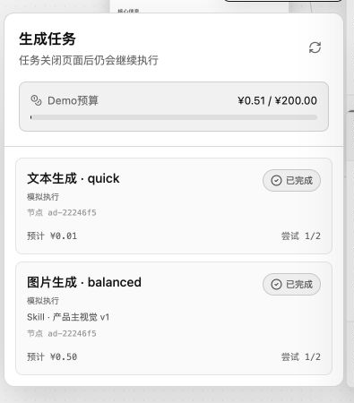
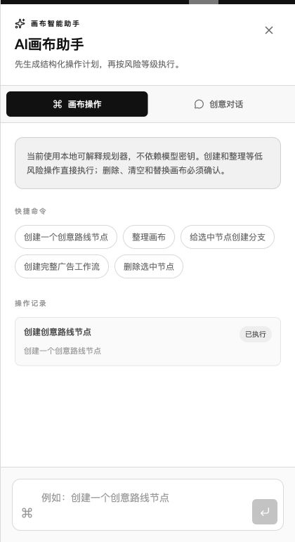
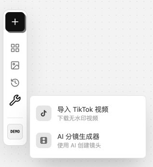
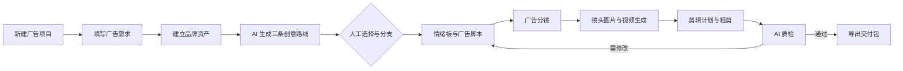

# AdCanvas 作品集项目介绍

AdCanvas 是一个面向中文广告创作者的 AI 自由画布。我以游戏和 AI 产品经理的视角重新设计了它的业务流程：不把产品停留在“选模型、输提示词、等结果”，而是把广告需求、品牌约束、创意路线、分镜、素材生成、质检和交付组织成一条能回看、能修改、能追责的制作链路。

当前版本是可运行的 PC Web Demo。它基于 Apache 2.0 授权的 TwitCanva 二次开发，保留自由画布和多模型生成基础，并补齐广告生产中真正影响决策的结构、状态和成本控制。

## 我想解决的问题

市面上的 AI 图片和视频工具大多围绕单次生成设计。创作者可以很快得到一张图，却很难回答三个更实际的问题：这张图来自哪条创意路线，是否违反品牌规范，以及修改上游需求后哪些内容需要重做。

因此，我没有继续堆模型入口，而是把核心对象定义为“广告项目”和“可追溯节点”。AI 负责起草、整理和生成，人负责确认需求、选择版本、控制预算和决定是否交付。画布不是展示层，而是项目状态本身。

我的几个主要产品判断是：

- 中文创作者需要完整的中文操作界面。模型名和技术参数可以保留英文，操作、错误和空状态必须说人话。
- 广告生产不是一条不可逆流水线。创意会分支，上游会修改，下游内容也可能因此过期。
- 真实模型调用有成本。生成前应先展示任务类型、模型、档位和预计费用，再由用户确认。
- AI 质检不能只给一句“不错”。它要说明检查了哪些证据、哪里不通过，以及下一步应该改什么。
- 没有 API 密钥时，Demo 仍应完整展示产品逻辑，但不能把模拟结果冒充真实生成。

## 从 TwitCanva 到 AdCanvas

TwitCanva 提供了节点画布、图片和视频生成、多模型入口、工作流保存等基础能力。我保留这些适合作为底座的部分，把产品方向从通用 AI 视频工作流改成广告创意与制作平台。

| 改动 | 为什么改 | 当前结果 |
| --- | --- | --- |
| 增加 10 类广告业务节点 | 通用生成节点无法表达广告项目的业务语义 | 一张画布保存从需求到交付的完整上下文 |
| 增加 AI 工作流草案 | 新用户面对空画布时不知道从哪里开始 | AI 可搭建流程，同时保留手动创建能力 |
| 增加品牌规范继承和局部覆盖 | 品牌规则需要跨节点生效，具体镜头也可能有例外 | 默认继承；覆盖时提示风险并留痕 |
| 增加版本、采用、分支和下游过期传播 | 广告创意会反复修改，旧结果不能直接丢失 | 能比较版本、保留路线，并定位待复核内容 |
| 统一文本、图片和视频任务链路 | 新旧入口并存会造成状态、费用和结果回写不一致 | 所有生成进入同一任务状态机 |
| 增加预算预留、费用确认、取消和重试 | 模型调用可能产生真实费用 | 付费任务执行前确认，任务中心统一管理 |
| 增加 AI 质检节点 | 生成结果缺少交付前的检查闸门 | 输出四项评分、问题和修改建议 |
| 增加可编辑项目包和交付清单 | 项目需要迁移、继续编辑和交接 | 支持导入导出与生产信息汇总 |
| 增加右侧画布智能助手 | 单纯聊天不能安全修改复杂画布 | 先生成操作计划，再按风险执行或确认 |
| 统一黑白灰视觉和中文界面 | 原有深色与中英文混排不适合目标用户 | 工作台、弹窗、错误和空状态统一 |

## 目前可以做什么

### 项目和画布

用户可以新建广告项目、打开最近项目、导入项目包，并在自由画布中创建、连接和编辑节点。

### 广告工作流

内置广告需求、品牌资产、创意路线、情绪板、广告脚本、广告分镜、镜头、剪辑计划、AI 质检和制作交付节点。AI 可以起草完整流程，用户也可以从空画布逐个创建。

### AI 生成和任务中心

文本、图片和视频生成使用统一任务协议。任务创建前显示推荐模型、质量档位、参考素材、预计费用和执行模式。任务中心负责预算占用、状态追踪、取消和重试。

### 画布智能助手

助手分为“画布操作”和“创意对话”。画布操作先形成结构化计划，再根据风险等级决定直接执行或等待确认；创意对话可以结合画布上下文和拖入的图片、视频素材给出建议。

### 创作者工具

当前工具菜单提供 TikTok 无水印视频导入和 AI 分镜生成器。分镜生成器包含参考素材、故事、脚本、预览和生成五个阶段。

### 版本、质检和交付

节点可以保存版本、采用旧版本和创建分支。上游采用内容变化后，下游节点会标记为可能过期。AI 质检基于画布证据生成品牌、产品、文案和平台四项评分，最后由制作交付节点汇总规格、采用素材和缺失项。

## 模拟流程

下面用一个虚构护肤品牌的 15 秒新品广告演示完整路径。

1. 新建“日光琥珀品牌概念广告”，交付目标设为 15 秒横版和竖版视频。
2. 在广告需求节点填写目标受众、核心信息和渠道；在品牌资产节点写入语调、色彩、Logo 规则和禁用内容。
3. 让 AI 生成三条创意路线。人工保留“清晨第一束光”，为另一条路线创建分支，不覆盖原方案。
4. 从采用路线生成情绪板和广告脚本，再将脚本拆成 5 个镜头。角色和产品参考图从素材库连接到对应镜头。
5. 选择“产品主视觉”或“首尾帧转场”Skill。系统展示模型建议和预计费用，确认后进入任务队列；无密钥环境改用明确标注的模拟执行。
6. 将采用的镜头素材交给剪辑计划生成粗剪方案，再运行 AI 质检。若核心卖点遗漏，质检节点标出问题，脚本和分镜回到待修改状态。
7. 复检通过后，导出可编辑项目包和制作交付清单，保留节点关系、采用版本、素材地址、规格和缺失项。

## 产品需求文档

下面的 PRD 使用可折叠区块。点击标题即可展开或收起。

<strong>1 产品目标与边界</strong>

### 产品目标

让中文广告创作者在一个项目中完成需求整理、创意发展、素材生成、版本决策、质量检查和交付准备，并能追踪上游变化对下游结果的影响。

### 当前目标用户

- 独立广告创作者和小型内容团队
- 需要组合多个图片、视频与文本模型的 AI 创作者
- 希望保留创作过程和版本依据的学生或作品集作者

### 当前版本不做

- 多人实时协作和复杂权限系统
- 正式的广告投放、归因和财务结算
- 替代专业剪辑软件的完整时间线
- 对模型生成内容作法律合规保证

<strong>2 核心用户任务</strong>

1. 从广告需求开始搭建一条可执行工作流。
2. 在项目级品牌规则下发展多条创意路线。
3. 连接参考素材并生成图片、视频或文本结果。
4. 在产生费用前知道模型、档位和预计成本。
5. 保存和采用版本，并识别因上游修改而过期的下游内容。
6. 在交付前运行质检并导出可继续编辑的项目包。

<strong>3 功能需求与验收标准</strong>

| 模块 | 需求 | Demo 验收标准 |
| --- | --- | --- |
| 项目工作台 | 新建、打开、搜索和导入项目 | 刷新后仍能找到项目；项目包可重新导入 |
| 自由画布 | 创建、连接、移动、编辑和删除节点 | 节点关系可保存并恢复；中文名称一致 |
| AI 工作流草案 | 从需求生成广告节点链路 | 生成前可预览；替换已有画布时要求确认 |
| 品牌约束 | 项目规则默认向下游继承 | 冲突可识别；局部覆盖需要明确确认 |
| 生成任务 | 统一文本、图片和视频请求 | 任务状态、费用和结果使用同一数据结构 |
| 任务中心 | 展示预算、状态、取消和重试 | 页面关闭后任务继续；失败任务可有限重试 |
| 版本系统 | 保存、采用和分支 | 采用上游新版本后，下游被标为可能过期 |
| AI 质检 | 检查四类证据并输出建议 | 分数范围有效；问题能指向待修改节点 |
| 项目导出 | 导出可编辑包和交接信息 | 导入后节点与父子关系完整；缺失项明确 |
| 中文界面 | 创作者操作全中文 | 菜单、弹窗、错误、空状态和辅助文本无无意义英文 |

<strong>4 信息结构与核心对象</strong>

- 项目：名称、品牌、预算、画布文档和更新时间。
- 节点：类型、位置、字段、父节点、生成结果和业务状态。
- 品牌规范：语调、色彩、字体、Logo 规则、必选和禁用内容。
- 版本：来源、创建时间、是否采用以及对应字段快照。
- 生成任务：类型、模型、Skill、档位、预计费用、执行模式和状态。
- 质检结果：综合分、四个维度分数、问题、建议和证据快照。
- 交付包：项目结构、采用素材、规格、后期说明和缺失项。

节点类型、模型供应商和 Skill 都通过注册表或适配层接入，后续增加新业务节点或新模型时不需要重写画布主体。

<strong>5 关键规则</strong>

- AI 可以建议和执行，但删除、清空、覆盖已有画布等高风险操作必须确认。
- 付费生成必须先确认任务类型、质量档位和预计费用。
- Provider 不可用时返回明确错误；模拟执行必须标注为模拟，不伪造真实素材。
- 项目品牌规范默认继承；节点选择覆盖后，不再自动接受项目硬性规则检查。
- 上游采用版本变化时，所有下游业务节点标为可能过期，不自动覆盖用户内容。
- AI 质检只基于当前画布证据评分，缺少素材或字段时降低对应维度并给出补充建议。

<strong>6 成功指标与后续验证</strong>

当前 Demo 优先验证流程可理解性，而不是生成质量本身。后续测试可记录：

- 首次进入后，用户是否能在 3 分钟内完成项目创建和需求填写。
- 从需求到首个可用分镜的完成率和耗时。
- 生成前费用确认的理解率，以及误触付费任务的次数。
- 上游修改后，用户能否正确判断需要复核的下游节点。
- AI 质检建议被采纳的比例，以及复检通过率。
- 项目包导出后在另一台设备恢复成功的比例。

## 当前状态

核心产品链路已能运行，自动化测试覆盖任务状态机、Provider 选择、预算确认、项目包、品牌约束、节点版本、AI 质检、中文节点展示和 FFmpeg 粗剪。真实上线前仍需补齐账号体系、对象存储、生产数据库、监控告警、模型密钥管理、内容安全和更完整的端到端测试。
